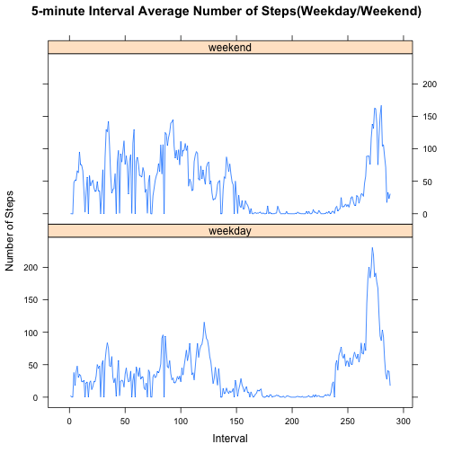

```r
##set up numerical output
options(scipen=1,digits=2)
```

## Loading and preprocessing the data

```r
activity <- read.csv("activity.csv",na.strings="NA",colClasses=c("integer","Date","factor"))
```


## What is mean and median of the total number of steps taken per day?
First we calculate the total steps per day and then calcualte the mean and median of the total steps per day

```r
total_steps        <- aggregate(steps~date,data=activity,sum)
mean_total_steps   <- mean(total_steps$steps)
median_total_steps <- median(total_steps$steps)
```

Here is the histogram of the total steps per day

```r
hist(total_steps$steps,main="Histogram of Total Steps Per Day", xlab="total_steps")
```

 

The mean of total steps per day is 10766.19 and the median of the total steps per day is 10765

## What is the average daily activity pattern?
First calculate the average number of steps taken across all days for each 5-minute interval then find out which 5-minute interval on average across all the days contains the maximum number of steps.


```r
avg_steps <- aggregate(steps~interval,data=activity,mean)
max_steps_interval <- avg_steps[which.max(avg_steps$steps),"interval"]
```

Here is the time series plot of the average number of steps during  the 5-minute interval across all days


```r
plot(steps~interval,data=avg_steps, main="5-minute Interval Avergae Number of Steps")
```

 

The interval 835 contains the maximum number of steps

## Imputing missing values
1 Calculate and report the total number of missing values in the dataset (i.e. the total number of rows with NAs)


```r
total_miss <- sum(!complete.cases(activity$steps))
```

The total number of missing values in the data set is 2304

2 Create a dataset with missed data filled with the mean steps for that interval 


```r
miss_idx <- which(!complete.cases(activity))
miss_data <- activity[miss_idx, ]
miss_data[,"steps"] <- avg_steps[match(activity[miss_idx,"interval"], avg_steps[,"interval"]),"steps"]
activity_new <- rbind(miss_data,activity[complete.cases(activity),])
```

3 Make a histogram of the total number of steps taken each day

```r
total_steps_new <- aggregate(steps~date,data=activity_new,sum)
hist(total_steps_new$steps,main="Histogram of Total Steps Per Day (New Dataset)", xlab="total steps per day")
```

 

4 Calculate the  mean and median total number of steps taken per day of the new dataset


```r
mean_total_steps_new <- mean(total_steps_new$steps)
median_total_steps_new <- median(total_steps_new$steps)
```

The mean of the total number of steps per day is 10766.19 and the same as the estimate from the first part of the assignment. 

The median of the total number of steps per day is 10766.19  and  smaller than the estimate from the first part of the assignment.

The imputing missing data doesn't affect the mean but increases the median.


## Are there differences in activity patterns between weekdays and weekends?
1 Create a new factor variable in the dataset with two levels – “weekday” and “weekend” indicating whether a given date is a weekday or weekend day.


```r
library(dplyr)
isWeekend <- weekdays(activity_new$date) %in% c("Saturday","Sunday")
activity_new$flags <- "weekday"
activity_new[isWeekend,"flags"] <- "weekend"
```

2 Make a panel plot containing a time series plot (i.e. type = "l") of the 5-minute interval (x-axis) and the average number of steps taken, averaged across all weekday days or weekend days (y-axis). 


```r
avg_steps_new <- activity_new %>% group_by(flags,interval) %>% summarize(steps=mean(steps))

library(lattice)
xyplot(steps~as.numeric(interval)|flags,data=avg_steps_new,layout=c(1,2),type="l",ylab="Number of Steps",xlab="Interval",main="5-minute Interval Average Number of Steps(Weekday/Weekend)")
```

 
